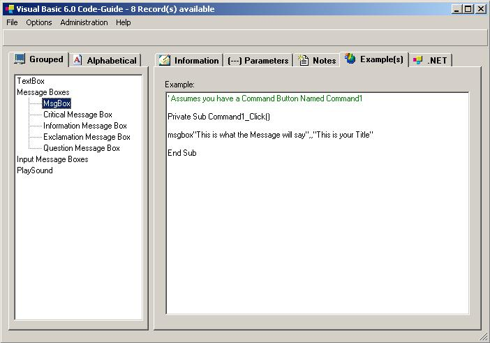



## Vb Code Guide

### Description

This is a Visual Basic Code Guide to keep track of all your Basic Code.. This is fra from Complete, so Suggest any thing yuo would like to be seen on it. And yes I know there are plenty of these on PSC.I wrote this foir my self and for others to learn not to just get votes.
 
### More Info
 

             |
---                |---
**Submitted On**   |2002-12-19 20:06:58
**By**             |[PFCGentry](https://github.com/Planet-Source-Code/PSCIndex/blob/master/ByAuthor/pfcgentry.md)
**Level**          |Advanced
**User Rating**    |4.1 (37 globes from 9 users)
**Compatibility**  |VB 5\.0, VB 6\.0
**Category**       |[Databases/ Data Access/ DAO/ ADO](https://github.com/Planet-Source-Code/PSCIndex/blob/master/ByCategory/databases-data-access-dao-ado__1-6.md)
**World**          |[Visual Basic](https://github.com/Planet-Source-Code/PSCIndex/blob/master/ByWorld/visual-basic.md)
**Archive File**   |[Vb\_Code\_Gu15166112212002\_0\_Code\_\-\_G\.zip](https://github.com/Planet-Source-Code/pfcgentry-vb-code-guide__1-41762/archive/master.zip)

